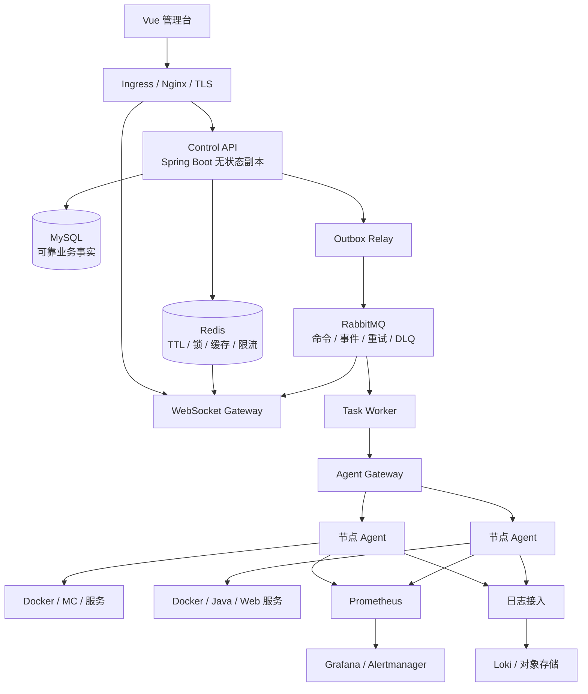

# Argus 企业级架构重设计

更新时间：2026-09-29  
状态：设计基线，尚未进入代码改造

## 1. 目标和边界

Argus 的目标是管理多台服务器上的服务实例。Minecraft 是第一个适配器，后续可以接入 Docker 服务、Java 服务、Nginx、Open WebUI 和其他可观测进程。

系统需要解决四件事：

1. 看见节点、实例、指标和日志的当前状态。
2. 可靠地下发启动、停止、重启、更新等受控操作。
3. 在节点断线、控制中心重启、消息重复和部分执行的情况下保持状态可恢复。
4. 在节点数量和日志量增长时，通过横向扩展和削峰保持可用。

AI 不是基础链路。AI 只能在指标、日志和审计数据之上做只读分析，不能绕过权限和任务编排器直接操作服务器。

第一阶段不直接拆成很多微服务，而采用“模块化单体控制中心 + 独立 Agent Gateway + 节点 Agent”。这样可以先保持事务边界清晰，再根据压测结果拆分高吞吐模块。

## 2. 总体拓扑



控制中心是控制面，负责权限、资源目录、期望状态、任务编排和审计。Agent 是数据面执行者，负责本机 Docker、进程和文件系统；浏览器、模型和数据库都不能直接获得 Docker 控制权限。

## 3. 模块边界

控制中心内部先保持一个 Spring Boot 部署单元，但代码按领域模块隔离：

| 模块 | 责任 | 不负责的事情 |
|---|---|---|
| Identity / Project | 用户、租户、项目、角色、资源范围 | 不直接执行服务器命令 |
| Node Registry | 节点注册、版本、能力、连接租约 | 不保存高频原始日志 |
| Instance Catalog | 服务实例、配置版本、期望状态和观测状态 | 不直接操作 Docker |
| Task Orchestrator | 权限校验、任务状态机、重试、超时、互斥 | 不长时间占用数据库事务等待 Agent |
| Outbox Relay | 将已提交的业务事件可靠发布到消息队列 | 不改变业务状态 |
| Agent Gateway | Agent 鉴权、连接、心跳、命令投递和回报 | 不绕过 Task Orchestrator 改任务状态 |
| Telemetry / Log Ingest | 指标、日志批量接收、背压和采样 | 不把每行日志写 MySQL |
| Alert / Policy | 规则、告警、恢复和通知 | 不直接越权执行命令 |
| Audit | 管理操作、状态迁移、证据链 | 不保存密码和私钥正文 |

Agent 协议需要版本化，至少包括 `register`、`heartbeat`、`command`、`command_ack`、`command_result`、`log_batch` 和 `metric_snapshot`。每条命令必须带 `commandId`、`taskId`、`deadline`、`fenceToken` 和协议版本。

浏览器到控制中心使用 REST 写入和 WebSocket 推送。Agent 的第一版通信保留 HTTPS 注册、心跳和任务拉取，先降低部署复杂度；协议稳定、节点规模上升后，再升级为 Agent 主动建立的 WebSocket 或 gRPC 双向流。无论使用哪种传输，都必须有序号、ACK、指数退避、断线补偿和协议向后兼容。Agent 主动出站可以避免给每台被管理服务器开放入站管理端口。

当前代码继续以 Java 17 + Spring Boot 为迁移基线，先不同时进行 Java 运行时升级。等新架构通过压测后，再单独评估 Java 21 LTS 升级，避免把运行时迁移和可靠性改造混在一起。

## 4. 基础设施职责

| 组件 | 可靠数据范围 | 使用方式 |
|---|---|---|
| MySQL | 用户、权限、节点目录、实例、期望状态、任务、任务尝试、任务事件、Outbox、审计 | 事务事实源；使用索引、分页、乐观锁和连接池 |
| Redis | 在线状态、最新快照、短缓存、限流、幂等短键、快速互斥 | 所有状态带 TTL；Redis 丢失后可从 MySQL 和消息重建 |
| RabbitMQ | 任务命令、任务事件、ACK、重试、死信 | 命令按节点路由，持久化队列和 quorum 队列；消费者必须幂等 |
| Prometheus | 主机、容器、服务和 MC 数值指标 | 拉取 `/metrics`；不把玩家名和日志正文做高基数标签 |
| Loki / 对象存储 | 日志正文和压缩后的日志块 | 按实例和时间检索；MySQL 只保存索引和摘要 |
| WebSocket | 页面实时事件 | 只做推送；断线后通过 REST 查询补偿，不把 WS 当事实源 |

任务命令优先使用 RabbitMQ，因为它适合确认、路由、重试和死信。日志和遥测达到万级 Agent 或持续高吞吐后，再引入 Kafka/Redpanda 做分区、回放和长时间缓冲。Redis Streams 可以用于轻量补偿事件，但不作为核心命令总线。

## 5. 三条数据管道

### 心跳和在线状态

Agent 每 10 秒发送带单调序号的心跳，Gateway 鉴权后只更新 Redis：

```text
node:{nodeId}:presence = {seq, version, resourceSummary}
TTL = 30 秒
```

节点状态变化、周期快照或版本变化时再异步批量写 MySQL。离线判断需要宽限和迟滞，避免网络抖动造成反复上线/离线。

容量基线：1000 个 Agent 每 10 秒约 100 次请求/秒；扩展目标是 10000 个 Agent、1000 次请求/秒。心跳不应该变成 N 个节点 × 每 10 秒一次的 MySQL 写入。

### 任务和命令

```text
REST 请求
  → 权限与参数校验
  → MySQL 事务写 tasks + outbox_events
  → Outbox Relay 发布 RabbitMQ
  → 按 nodeId 路由到 Agent Gateway
  → Agent inbox 去重、ACK、异步执行
  → 回报 RUNNING / RESULT
  → 幂等消费者更新 MySQL
  → WebSocket 推送页面
```

投递语义是“至少一次投递 + 幂等执行”，不承诺不存在现实中无法证明的 exactly-once。每个实例同时只允许一个互斥操作，启动、停止、重启等动作按类型声明是否安全重试。

### 日志、指标和告警

Agent 对日志分块、本地短暂缓存并批量发送；接入层实施大小限制、速率限制和背压。日志正文进入 Loki 或对象存储，MySQL 只存实例、时间范围、序列号和存储地址。按 1KB/s/Agent 估算，1000 个 Agent 的原始日志约 86GB/天，必须压缩、短期热存储和冷热分层。

指标由 Prometheus 拉取 Agent、容器和控制中心的指标，Grafana 展示，Alertmanager 负责通知。告警事件和恢复记录进入 MySQL，但原始时序不进入业务表。

## 6. 安全边界

- 管理台只暴露 HTTPS；公网入口只开放 443，数据库、Redis 和 MQ 放在私网。
- 控制中心使用 Spring Security，目标方案采用 OIDC/JWT、租户/项目级 RBAC 和资源级授权。
- 每台 Agent 使用独立 mTLS 证书，或使用可轮换、可吊销的短期令牌；不能只相信消息中的 `nodeId`。
- Agent 通过白名单动作调用 Docker，Docker 控制权限留在节点本地；浏览器和 AI 不接触 Docker socket。
- 所有人工操作、权限变更、任务状态迁移和 Agent 凭据轮换写入审计。
- 密码、私钥和令牌使用环境变量或 Secret 管理，不进入代码、文档、日志和数据库普通字段。
- MySQL 入口仅允许所需的控制中心来源，并为应用账户设置最小权限。

## 7. 目标部署拓扑

业务节点、控制节点与数据节点按职责规划资源。业务节点保留轻量 Agent，控制节点扩展前先测量容量，数据库单独管理权限、备份和恢复。

高可用目标包括控制中心多副本、RabbitMQ quorum、Redis Sentinel/Cluster、MySQL 备份和可选只读副本。这些是设计选项，当前仓库尚未实现或验证对应集群；不能把单实例功能验证当作高可用交付。

## 8. 非功能目标

| 指标 | 第一版目标 | 扩展目标 |
|---|---:|---:|
| Agent 心跳 | 1000 个、100 次请求/秒 | 10000 个、1000 次请求/秒 |
| 心跳接口 | P99 < 200ms，不直写 MySQL | P99 < 100ms |
| 任务创建 | P99 < 300ms | P99 < 500ms |
| 命令投递确认 | P99 < 2s | 按节点队列和优先级扩展 |
| WebSocket | 1000 个连接 | 10000 个连接 |
| 数据恢复 | RPO ≤ 5 分钟，RTO ≤ 15 分钟 | 通过托管服务和多副本降低 |
| 可用性 | 单实例演示 | 控制中心多副本月可用性 99.9% |

这些指标必须通过压测和故障演练验证，不能只写在技术栈里。
