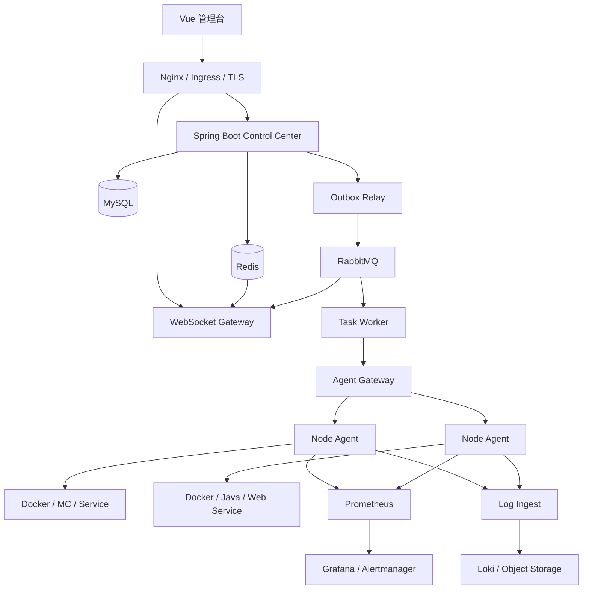

# Argus 平台设计文档

更新时间：2026-09-29  
文档状态：设计基线，供代码改造前评审  
实现状态：本文只描述目标设计，不代表所有组件已经落地

## 1. 项目概述

Argus 是面向多台服务器和多种服务实例的运维管理平台。它以 Minecraft 作为第一个业务适配器，但平台核心不绑定 Minecraft，后续可以接入 Docker、Java、Nginx、MySQL、Redis、Open WebUI 和其他具备管理接口的服务。

平台要解决的问题是：服务器多、服务类型不同、状态分散在各台机器上，人工登录服务器查看状态和执行操作容易遗漏，也无法稳定处理心跳、日志、重复命令和断线恢复。

Argus 的核心业务对象是：

| 对象 | 含义 |
|---|---|
| Node | 一台被管理的服务器 |
| Agent | 安装在 Node 上的执行代理 |
| Instance | Node 上的一个服务实例，例如容器、Java 服务或 Minecraft |
| Adapter | 某类服务的发现、监控、日志和操作插件 |
| Task | 对 Instance 的一次受控操作 |
| Event | 状态变化、任务回报和审计事件 |
| Telemetry | 指标、日志和健康数据 |

## 2. 设计目标

1. 统一管理不同服务器和服务类型。
2. 支持节点离线、消息重复、控制中心重启和执行结果未知等异常场景。
3. 让心跳、日志和任务互相隔离，避免高频数据压垮业务数据库。
4. 允许新服务通过 Adapter 接入，不修改控制中心核心任务系统。
5. 提供权限、审计、指标、日志和告警能力。
6. 在规模增加后可以横向扩展，但不在没有压测数据时拆成大量微服务。

AI 属于最后阶段。AI 只能读取经过权限过滤的指标、日志和事件，生成诊断和建议，实际执行仍然复用权限和任务系统。

## 3. 总体架构



第一阶段采用模块化单体控制中心，逻辑上分模块，部署上先保持一个 Spring Boot 服务。Agent Gateway、日志接入和任务 Worker 可以先作为独立模块或进程，等压测证明出现瓶颈后再拆分部署。

## 4. 模块职责

| 模块 | 主要职责 |
|---|---|
| Identity / Project | 用户、租户、项目、角色和资源授权 |
| Node Registry | 节点注册、Agent 版本、能力、连接代次和在线状态 |
| Instance Catalog | 实例目录、服务类型、配置版本、期望状态和观测状态 |
| Adapter Registry | Adapter 清单、版本、兼容范围和能力声明 |
| Task Orchestrator | 权限检查、任务状态机、重试、超时、互斥和恢复 |
| Outbox Relay | 在业务事务提交后可靠发布事件 |
| Agent Gateway | Agent 身份验证、心跳、命令投递和回报接收 |
| Telemetry / Log Ingest | 指标、日志批量接收、限速、压缩和背压 |
| Alert / Policy | 告警规则、告警事件、恢复和通知 |
| Audit | 管理操作、权限变化和任务状态迁移的审计 |

## 5. 服务适配器设计

### 5.1 为什么需要 Adapter

不同服务的健康标准、指标和操作不同：Minecraft 关注 TPS 和 MSPT，MySQL 关注连接数和慢查询，Nginx 关注请求延迟和 5xx，Redis 关注内存和命令吞吐。

通用 Agent 只负责通信、认证、调度、缓冲和权限边界；服务差异全部放在 Adapter 中。

### 5.2 Adapter 清单

每个 Adapter 提供一份版本化清单，控制中心据此知道它支持什么：

```yaml
type: postgresql
version: 1.0
supportedVersions: ["14", "15", "16"]
discovery:
  - process
  - container-label
  - port: 5432
metrics:
  - name: db.connections.active
    unit: connections
    interval: 15s
  - name: db.query.slow_count
    unit: count
    interval: 30s
actions:
  - HEALTH_CHECK
  - RESTART
  - BACKUP
logSources:
  - postgresql.log
requiredPermissions:
  - read_status
```

清单必须声明版本、支持的服务版本、发现方式、指标、日志来源、操作、所需权限、默认采样间隔和资源消耗等级。指标名称和单位使用统一规范，不能让每个 Adapter 自己发明无法查询的字段。

生产环境中的清单还需要包含 `adapterId`、`manifestApiVersion`、发布者、版本、摘要和签名。控制中心只接受已登记、签名有效且未撤销的 Adapter；Agent 安装包固定摘要，升级支持灰度和回滚。清单只声明 Secret 引用名和权限范围，不能携带密码。

### 5.3 能力如何被确认

系统不是凭名称猜测能力，而是按以下顺序确认：

1. Agent 上报主机、Docker、进程、端口和镜像信息。
2. Adapter 使用进程名、容器标签、镜像名、端口或配置文件进行发现。
3. Adapter 连接服务 API，读取真实版本，例如执行 PostgreSQL 的 `SELECT version()`。
4. Adapter 检查当前凭据能读取哪些状态和执行哪些操作。
5. 只有声明支持、版本兼容且探测成功的能力才注册为 `AVAILABLE`。

探测结果应保存实例指纹、Adapter 摘要、版本、置信度、脱敏证据和探测时间。低置信度或高风险候选进入人工确认；无法识别服务版本时自动降级为只读，不猜测可执行动作。

能力状态包括：

```text
DECLARED      Adapter 清单声明支持
PROBING       正在探测
AVAILABLE     版本和权限检查通过
UNAVAILABLE   服务不支持、版本不兼容或权限不足
DEGRADED      能运行但部分指标或操作不可用
```

能力探测发生在 Agent 首次注册、服务版本变化、容器变化、Adapter 升级或管理员手动刷新时，不在每次心跳中重复执行。

### 5.4 统一 Adapter 接口

每个 Adapter 至少提供以下能力：

```text
discover()         发现实例
probeVersion()     读取服务版本
healthCheck()      判断服务是否真正可用
collectMetrics()   采集服务专属指标
collectLogs()      声明日志来源
validateAction()   校验操作前置条件
executeAction()    执行白名单操作
```

Adapter 不允许执行任意 shell。操作必须是明确的动作类型，参数经过 Schema 校验，并由 Agent 的本地白名单再次确认。

### 5.5 新类型服务接入流程

以接入 PostgreSQL 为例：

```text
安装通用 Agent
    ↓
注册节点并完成 mTLS/令牌认证
    ↓
安装或启用 PostgreSQL Adapter
    ↓
发现进程、容器、端口和配置
    ↓
探测版本、连接权限和健康状态
    ↓
注册实例与 AVAILABLE 能力
    ↓
采集 PostgreSQL 指标和日志
    ↓
按权限开放备份、重启等操作
```

新增服务类型不应该要求修改核心 Task Orchestrator、Redis 锁或 RabbitMQ 任务协议。只要 Adapter 遵守统一契约，控制中心就能使用通用的实例页面、任务状态和审计流程。

接入顺序建议是先实现 `docker-generic`，提供容器发现、生命周期、基础资源和 stdout 日志能力；再实现 Minecraft、OpenWebUI、数据库等专用 Adapter。每个 Adapter 上线前都要完成清单 Schema 校验、签名校验、隔离 Agent 探测、权限不足测试、命令注入和路径穿越测试、重复任务测试、断线重连测试以及灰度回滚。

## 6. 数据和消息职责

| 组件 | 保存或处理的内容 | 不应承担的内容 |
|---|---|---|
| MySQL | 用户、节点、实例、期望状态、任务、任务尝试、任务事件、Outbox、审计 | 高频心跳、逐行日志、原始时序指标 |
| Redis | 在线 TTL、短缓存、限流、快速锁、幂等短键、WebSocket 广播 | 长期任务事实、审计、唯一数据副本 |
| RabbitMQ | 任务命令、ACK、结果事件、重试和死信 | 长期保存所有日志正文 |
| Prometheus | 数值指标和时间序列 | 业务任务状态和日志正文 |
| Loki/对象存储 | 日志正文、压缩日志块 | 用户权限和任务状态 |

命令使用 RabbitMQ 的持久化队列、ACK、重试和死信。日志和遥测规模达到万级 Agent 后，再引入 Kafka/Redpanda 进行分区和回放；Redis Streams 只用于轻量补偿，不作为核心命令总线。

## 7. 任务业务流程

```text
用户登录
  ↓
选择项目和实例
  ↓
权限、参数、版本和操作冲突校验
  ↓
MySQL 事务写入 Task + Outbox
  ↓
Outbox Relay 发布 RabbitMQ
  ↓
Agent Inbox 按 commandId 去重并 ACK
  ↓
获取实例锁并执行 Adapter 动作
  ↓
回报 RUNNING / SUCCEEDED / FAILED / UNKNOWN
  ↓
控制中心用 CAS + fence 更新状态
  ↓
保存 TaskEvent、审计并 WebSocket 推送
```

任务采用至少一次投递和幂等执行。核心状态为：

```text
PENDING → DISPATCHING → DELIVERED → RUNNING
                                      ├→ SUCCEEDED
                                      ├→ FAILED → RETRY_WAIT
                                      ├→ TIMEOUT
                                      └→ UNKNOWN → RECONCILING
```

`UNKNOWN` 不能直接重试。系统必须先查询 Agent 和实例的实际状态，再决定成功确认、补偿、重试或人工处理。旧任务的迟到回报不能覆盖新任务，使用 `fenceToken` 和数据库版本号进行保护。

## 8. 心跳、日志和指标流程

- **心跳**：Agent 每 10 秒发送序号、版本和资源摘要；Redis 保存 30 秒 TTL；状态变化和周期快照异步写 MySQL。
- **指标**：Agent 或 exporter 暴露 Prometheus 指标；指标标签限制基数，玩家名、任务 ID 和日志内容不能作为常规标签。
- **日志**：Agent 分块、本地有界缓存、批量压缩发送；接入层限速和背压；日志正文进入 Loki/对象存储，MySQL 只保存索引和摘要。
- **页面实时状态**：WebSocket 只推送事件，断线后通过 REST 查询补齐，不依赖 WebSocket 作为事实源。

## 9. 安全设计

- 管理台使用 HTTPS，公网只暴露 443。
- 控制中心使用 Spring Security、OIDC/JWT、租户/项目级 RBAC 和资源级授权。
- 每台 Agent 使用独立 mTLS 证书或可轮换短期令牌，支持吊销。
- Docker 权限只存在于本地 Agent；浏览器、数据库和 AI 不直接访问 Docker socket。
- MySQL、Redis、RabbitMQ 使用私网或安全组白名单，不对公网开放。
- 所有人工操作、权限变更、命令投递和状态迁移进入审计日志。
- 密码、私钥和令牌只进入 Secret 管理和环境变量，不写入代码或普通日志。

## 10. 通用部署边界

- 业务节点运行服务实例和轻量 Agent，避免挤占业务服务资源。
- 控制节点承载 API 与前端入口；引入消息队列和监控组件前，先评估磁盘、内存与数据保留量。
- 数据节点承载 MySQL，限制网络来源并独立验证备份恢复。

角色可以用于单实例验证，但角色分开不等于已经高可用。多副本控制节点或托管组件属于后续生产部署方案，需用故障演练验证。

## 11. 分阶段实施

| 阶段 | 内容 | 验收 |
|---|---|---|
| P0 设计冻结 | 协议、领域模型、状态机、容量和威胁模型 | 文档评审通过，契约无冲突 |
| P1 数据底座 | 任务尝试、事件、Outbox、审计、版本和索引 | 迁移可重复，旧 API 兼容 |
| P2 并发与可靠任务 | Redis、RabbitMQ、Inbox、重试、死信、真实执行器 | 1000 Agent 心跳、重复任务无副作用 |
| P3 观测和实时 | WebSocket、Prometheus、Grafana、Loki、告警 | 断线可补偿，指标和日志可追踪 |
| P4 安全 | OIDC/JWT、RBAC、Agent 凭据轮换和网络隔离 | 越权、重放和失效令牌全部拒绝 |
| P5 高可用 | 控制中心多副本、Redis HA、RabbitMQ quorum、数据库备份 | RPO ≤ 5 分钟，RTO ≤ 15 分钟 |
| P6 AI | 只读诊断、证据引用、人工确认后的方案执行 | AI 不得绕过权限和任务系统 |

## 12. 设计结论

Argus 的扩展点是 Adapter，而不是为每种服务器复制一套控制中心。通用 Agent 负责连接和安全边界，Adapter 负责服务差异，控制中心负责统一的资源、任务、事件和权限模型。这样新增服务只需要完成“发现、能力探测、指标、日志和白名单操作”五类契约，就可以接入现有平台。

更详细的数据表和故障恢复规则见：[数据模型与任务可靠性](Argus数据模型与任务可靠性.md)；分阶段迁移和压测计划见：[从 MVP 到生产迁移计划](Argus从MVP到生产迁移计划.md)。
