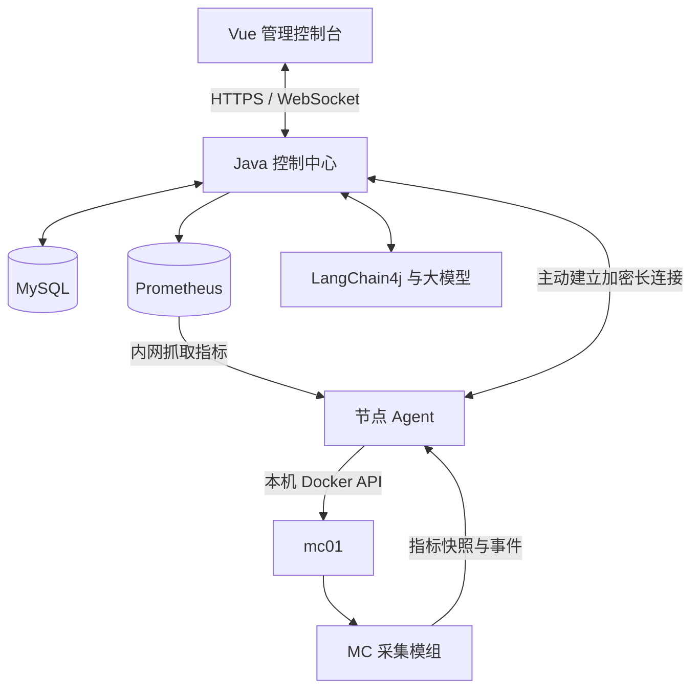

# Argus 技术方案与实施路线

> 说明：本文保留早期业务范围和阶段背景。企业级架构、可靠性模型和从 MVP 到生产的实施顺序，以 [企业级架构重设计](Argus企业级架构重设计.md)、[数据模型与任务可靠性](Argus数据模型与任务可靠性.md) 和 [从 MVP 到生产迁移计划](Argus从MVP到生产迁移计划.md) 为当前设计基线。

更新日期：2026-09-22  
文档性质：开发设计与实施规划；具体依赖版本在工程初始化时确认兼容性并锁定。

> 状态提示：本文是规划基线，不是实时部署清单。实际完成项以 [开发进度](开发进度.md) 和 [问题记录](问题记录.md) 为准；[部署角色说明](部署角色说明.md) 只描述通用部署职责。

## 1. 项目要解决什么问题

Argus 是一个以 Minecraft 为首个应用场景的智能运维平台，目标是做成可以实际部署、演示和验证的 Java 后端项目。

用户可以通过网页管理服务器、查看指标和日志、追踪操作任务，并让 AI 基于真实数据分析异常。后续逐步加入受控执行、效果验证和历史经验检索。

核心流程：

```text
观察服务器 → 发现异常 → 收集证据 → 分析原因
                                    ↓
保存处理记录 ← 验证效果 ← 执行操作 ← 制定方案
```

Java 后端负责业务规则、权限、数据存储和可靠执行；AI 负责分析证据和提出方案。前端提供可操作、可观察的界面。

### 示例场景

首个场景是容器化 Minecraft 服务，后续扩展到其他 Docker 应用。仓库提供通用部署与备份模板，具体服务器、容器名、挂载目录、端口及世界数据由部署者在私有配置中维护。

当前代码能查询节点与容器资源快照，尚未实现真实任务执行闭环、游戏专项指标和 AI 诊断。Minecraft 的玩家认证与模组配置由游戏服务单独管理，不属于已经实现的平台身份权限体系。

## 2. 技术栈

| 层次 | 技术选择 | 具体职责 | 引入阶段 |
|---|---|---|---|
| 管理前端 | Vue 3、TypeScript、Vite、Element Plus | 登录、节点、实例、任务、日志页面 | 第一阶段 |
| 图表 | ECharts | 指标历史曲线 | 第四阶段 |
| 控制中心 | Java 17、Spring Boot 3 | 接口、业务逻辑、调度与组件整合 | 第一阶段 |
| 身份权限 | Spring Security | 登录认证、角色和项目访问权限 | 第一阶段 |
| 数据访问 | Spring JDBC、MySQL/H2 | 业务数据和任务状态持久化 | 第一阶段 |
| 数据库迁移 | Flyway | 记录和执行数据库结构变更 | 第一阶段 |
| 节点通信 | WebSocket over TLS | Agent 长连接、任务下发与结果回传 | 第二阶段 |
| 页面实时更新 | WebSocket | 实时日志和任务进度 | 第三阶段 |
| 容器管理 | Docker Engine API | 查询、启动、停止、获取容器日志 | 第二、三阶段 |
| 主机采集 | 操作系统接口，按需使用 OSHI | CPU、内存、磁盘等数据 | 第四阶段 |
| MC 采集 | 自研 NeoForge 服务端模组 | 游戏指标、事件与 MC JVM 数据 | 第四阶段 |
| 指标体系 | Micrometer、Prometheus | 指标暴露、采集、存储和查询 | 第四阶段 |
| AI 接入 | LangChain4j、大模型 API | 工具调用、诊断和方案生成 | 第五阶段 |
| 部署 | Docker Compose、Nginx | 组件编排、持久化和 HTTPS 入口 | 随阶段推进 |

第一版先采用一个模块化的 Spring Boot 控制中心，节点 Agent 单独部署。AI 使用外部模型 API，模型供应商和具体模型待接入时选择。

后续组件按实际需求引入：

- Redis：用于明确需要的缓存、限流或多实例共享临时状态；任务最终状态仍保存在数据库。
- 消息队列：在任务规模、多消费者或投递可靠性需求增加后引入，同时保留消费幂等设计。
- 向量数据库：积累足够的故障案例和文档、开始做语义检索后引入。
- 沉浸式可视化：在真实数据链路稳定后，展示节点状态和 Agent 分析过程。

## 3. 系统组成与部署关系



不支持 Mermaid 的阅读器可以按以下关系理解：浏览器访问控制中心；控制中心访问数据库和指标库；Agent 主动连接控制中心；Agent 在本机管理 Docker，并接收 MC 采集模组的数据。

三个后端组件各自承担不同职责：

| 组件 | 运行位置 | 职责 |
|---|---|---|
| argus-server | 控制中心所在机器 | 用户接口、权限、业务状态、任务调度、AI 分析 |
| argus-agent | 每台被管理的机器 | 采集本机信息、管理允许操作的容器、执行并记录任务 |
| argus-minecraft-bridge | MC 服务端进程内部 | 读取游戏内部状态并生成监控快照 |

开发时可以在本地运行控制中心和前端，在腾讯云运行 Agent 与 mc01。最终演示时可以同机部署，也可以加入本地节点展示跨机器管理。

Agent 主动建立连接，降低被管理节点必须开放入站管理端口的需求。Docker 接口由本机 Agent 使用；浏览器和模型不直接获得 Docker 管理权限。

Prometheus 指标抓取需要实际可达的网络路径。同机部署走私有网络；跨机器演示时再配置私网或经过认证的采集通道，不能假设 Agent 长连接会自动解决 Prometheus 的网络可达性。

## 4. 熟悉的 Java 分层如何使用

第一版可以按传统技术分层组织代码：

```text
argus-server/
└── src/main/java/.../argus/
    ├── controller/       接收请求、校验参数、返回响应
    ├── service/          业务接口
    │   └── impl/         业务规则、事务和模块协作
    ├── mapper/           数据库查询与更新
    ├── entity/           数据库实体
    ├── dto/              请求参数
    ├── vo/               返回给页面的数据
    ├── security/         身份认证和权限
    ├── websocket/        连接、消息分发和订阅管理
    ├── scheduler/        后台任务调度与恢复
    ├── agent/            节点协议与任务下发
    ├── ai/               模型配置、工具和诊断编排
    ├── config/           配置
    └── exception/        异常与统一处理
```

业务范围包括 identity、node、instance、task、monitoring、audit、intelligence。规模扩大后，可以把每个业务自己的 controller、service、mapper 放进对应业务包中；初期不必为目录结构频繁重构。

以实例管理为例：

| 类 | 职责 |
|---|---|
| InstanceController | 接收查询和操作请求，进行基础参数校验 |
| InstanceService / InstanceServiceImpl | 检查权限、处理操作规则、协调任务创建 |
| InstanceMapper | 访问实例表 |
| Instance | 实例身份、所属节点、关联容器等数据 |
| CreateInstanceDTO | 接收名称、版本、内存等输入 |
| InstanceDetailVO | 返回实例详情、最近观测状态和活动任务 |

Service 接口与 Impl 可以沿用熟悉的做法。关键是让业务规则集中、事务边界明确，并能测试。

### 查询流程

```text
Vue 页面 → InstanceController → InstanceService → InstanceMapper → MySQL
                                      ↓
                           组装 InstanceDetailVO → 返回页面
```

数据库中的运行状态只是最近观测结果。界面应携带更新时间，节点失联时不能继续把旧数据当作当前实时状态。

### 操作流程

```text
页面提交重启请求
    ↓
Controller 校验参数
    ↓
Service 检查权限、实例状态、冲突操作
    ↓
事务内保存任务和待发送记录
    ↓
返回 taskId，页面显示待执行
    ↓
后台调度器下发任务
    ↓
Agent 去重、检查本地状态、安全执行
    ↓
保存执行结果并回传
    ↓
控制中心更新任务，通过 WebSocket 推送结果
```

调用远端 Agent 不放在长时间持有的数据库事务里。创建任务与等待执行结果是两个步骤。

## 5. 数据模型与协议设计方向

以下是初始建模范围，具体字段在对应阶段实现前细化。

| 数据表 | 主要用途 |
|---|---|
| users、roles、user_roles | 用户与角色 |
| projects、project_members | 项目归属与访问范围 |
| nodes | 节点身份、连接状态、最后心跳、能力信息 |
| instances | 所属节点、实例类型、Docker 容器标识、配置及观测状态 |
| tasks | 操作类型、参数、申请人、状态、幂等键、执行期限 |
| task_attempts | 每次投递或执行尝试、结果及错误信息 |
| task_events | 任务状态变化与进度时间线 |
| outbox_events | 与任务一起入库、等待后台发送的记录 |
| audit_logs | 谁在什么时间对什么对象做了什么 |
| alert_rules、incidents | 告警规则、异常事件及恢复记录 |
| diagnoses、action_plans | AI 诊断证据、结论、操作方案与确认状态 |

分页列表根据实际查询建立索引，例如按实例查询最近任务、按状态查待执行任务。多项目查询必须带访问范围限制。

Agent 消息建议包含：protocolVersion、messageId、nodeId、taskId、timestamp、type、payload。任务消息另带执行期限和幂等标识。

节点身份需要与认证凭据绑定，不能只相信消息里自报的 nodeId。控制中心和 Agent 都要校验操作类型、目标实例和参数。

### 任务可靠性

- 重复提交：幂等键配合唯一约束，返回已有任务或明确拒绝参数不一致的重复请求。
- 操作冲突：同一实例的启停、重启和一致性备份按互斥规则执行。
- 任务认领：用条件更新或版本号控制并发认领，避免多个执行器同时下发。
- 重复投递：Agent 保存 taskId 与执行结果，收到重复任务时核对并返回结果。
- 中途断网：标记结果待核实，重连后补报和核对实际状态。
- 执行失败：按操作类型决定是否重试，不能对所有任务统一盲目重试。
- 超时：区分任务超过期限和远端实际停止执行；必要时继续核对远端状态。
- 服务重启：从数据库恢复未完成任务，结合 Agent 记录完成状态对账。

目标是“可重试的投递 + 幂等执行 + 状态核对”，不能仅凭消息队列或 taskId 宣称所有操作恰好执行一次。

## 6. 监控数据从哪里来

| 数据 | 数据来源 | 说明 |
|---|---|---|
| 主机 CPU、内存、磁盘 | 节点 Agent 读取操作系统信息 | 区分整台机器和单个实例 |
| 容器 CPU、内存、运行状态 | Docker API | 容器运行不代表游戏已经就绪 |
| MC 堆内存、GC、线程 | MC 进程内读取 JVM 管理接口 | 控制中心自身的 JVM 指标不能代表 MC |
| TPS、MSPT | MC 采集模组 | 明确采样窗口和计算方式；MSPT 表示每个游戏刻的处理时间 |
| 玩家、实体、区块 | MC 采集模组 | 明确按实例、维度统计的范围 |
| 游戏日志 | Docker 日志流 | 限制订阅、缓冲区和单次读取量 |
| 配置与操作变化 | 任务和审计记录 | 与指标放到统一时间线上分析 |

MC 采集模组在游戏线程读取必要数据并生成快照，后台线程负责发送，避免网络请求阻塞游戏线程。节点短暂断开时采用有上限的缓冲，避免无限积压。

Prometheus 保存数值指标；MySQL 保存业务与事件。第一版日志保留在服务端，按需读取有限时间段或有限行数。集中日志检索可以后续扩展。

监控接口应标记采样时间、单位、数据来源和缺失状态。玩家名称、每条任务 ID 等高变化字段不作为常规指标标签，避免指标规模失控。

## 7. AI 怎样接入已有 Java 业务

先实现只读诊断，再逐步开放方案执行。

示例工具：

```text
queryMetrics(instanceId, timeRange, metricNames)
queryLogs(instanceId, timeRange, limit)
queryRecentChanges(instanceId, timeRange)
queryIncidents(instanceId, timeRange)
```

一次诊断的流程：

```text
用户提问或告警触发
    ↓
明确实例与时间范围
    ↓
AI 选择查询工具
    ↓
Java 服务校验权限、参数、查询范围
    ↓
查询真实数据并返回给模型
    ↓
生成结构化诊断报告
    ↓
保存工具调用、证据、结论与缺失信息
```

报告至少区分：观察到的现象、支持证据、可能原因、尚未确认的信息、建议措施。数据缺失时如实说明；指标同时变化不自动等于因果关系。

执行阶段使用“生成方案 → 检查操作权限和前置条件 → 用户确认或匹配已授权规则 → 创建任务 → 观察结果”的流程。

模型只提出受支持的业务操作，实际执行复用 TaskService 和 Agent。配置变更先保存原值；明确是否需要重启、是否能恢复。删除数据等不可逆操作不能套用“修改失败就回滚”的假设。

第一版给诊断设置工具调用次数、查询窗口和超时上限，并记录耗时与模型调用量。后续通过历史事件检索辅助诊断，避免一开始就扩大知识库范围。

## 8. 分阶段实现与验收

### 第一阶段：基础后台

实现内容：

- 初始化 Spring Boot、Vue 和数据库工程。
- 统一响应、参数校验、异常处理、结构化日志。
- 登录、基础角色和项目访问范围。
- 节点、实例的基础建模和数据库迁移。

验收：能登录并查看有权限的实例列表；无权限访问被拒绝；空列表与错误状态有明确界面提示。演示数据必须标明为模拟数据。

### 第二阶段：接入真实节点

实现内容：

- Agent 注册、身份认证、心跳和断线重连。
- 读取 Docker，发现并登记 mc01。
- 定期更新容器状态与最近观测时间。
- 前端节点页、实例详情页。

验收：页面显示真实 mc01；停止 Agent 后节点进入离线状态；重新连接后能够恢复。容器不存在或 Docker 不可用时返回明确状态。

### 第三阶段：实例操作、任务与日志

实现内容：

- 启动、停止、重启接口。
- 持久化任务状态、幂等处理、实例操作互斥。
- 后台调度、Agent 执行记录、断线后的状态核对。
- 日志订阅、任务进度、审计记录。

验收：网页可以实际控制 mc01；停止时等待保存；重启完成以游戏就绪为依据。重复请求不会重复重启，断网后可核对结果，日志订阅不会无限占用内存。

这一阶段结束后，已具备可独立演示的 Java 服务器管理平台。

### 第四阶段：监控与告警

实现内容：

- 主机、容器和 MC 内部指标采集。
- Prometheus 指标存储与历史查询。
- 监控图表、实例就绪检测。
- 告警持续时间、去重、恢复条件和事件记录。

验收：能够区分主机与 MC 资源；缺失数据不会显示成零；测试环境中的异常可以触发并恢复告警；长期波动不会重复产生大量相同事件。

### 第五阶段：AI 只读诊断

实现内容：

- 接入模型与 LangChain4j。
- 实现指标、日志、变更和历史事件查询工具。
- 保存诊断过程和结构化报告。
- 前端展示证据与结论。

验收：通过预先准备的案例验证工具选取和证据引用；没有足够证据时明确表示不确定；无法访问用户无权限的实例。

### 第六阶段：受控执行与效果验证

实现内容：

- 生成操作方案、记录确认状态。
- 接入已有任务系统。
- 执行前保存支持恢复的配置，执行后检查状态与指标。
- 保存验证结果和恢复记录。

验收：完整展示一次“发现问题 → 提出方案 → 确认 → 执行 → 验证”。失败案例可以展示受支持的恢复流程；有其他因素干扰时不把指标变化简单归功于操作。

### 第七阶段：扩展、测试与展示

实现内容：

- 增加真实节点或模拟节点，验证并发连接、心跳和任务调度。
- 根据瓶颈决定是否加入 Redis 或消息队列。
- 引入历史案例与文档检索。
- 完善沉浸式状态展示、部署文档与演示脚本。

验收：提供可复现的测试环境、参数、结果和限制。模拟节点测试证明控制中心相应链路的承载能力，不能替代真实 Minecraft 玩家容量测试。

## 9. 能体现哪些 Java 后端能力

| 能力 | 项目中的证据 |
|---|---|
| 业务建模 | 节点、实例、项目、任务的关系和访问边界 |
| SQL 与事务 | 任务创建、待发送记录、索引、分页与条件更新 |
| 认证和权限 | 用户角色、项目范围、Agent 身份认证 |
| 并发编程 | 有界执行器、任务互斥、日志背压与连接管理 |
| 异步任务 | 先返回 taskId，后台执行，实时展示进度 |
| 状态机 | 实例状态、任务状态、告警恢复规则 |
| 分布式可靠性 | 重复投递、断线恢复、执行结果核对 |
| 测试与可观测性 | 集成测试、故障注入、服务指标和可追踪日志 |
| AI 工程 | 真实工具调用、证据记录、权限和调用预算 |

重点是能解释每个设计解决了什么具体问题，并拿出正常路径与故障路径的验证结果。

## 10. 第一个可交付版本

当前 MVP 已完成控制中心、Agent、管理前端以及节点、实例、任务、日志的数据库持久化。默认使用 H2 文件库，生产连接通过 `mysql` profile 切换到 MySQL；AI 诊断仍留在后续阶段。

先完成以下流程：

```text
登录 Argus
    ↓
看到腾讯云节点在线
    ↓
打开 mc01 详情
    ↓
查看容器状态与实时日志
```

随后补齐启动、停止、重启、任务记录与审计，再加入监控和 AI。

当前开发检查表：

- [x] 准备真实 Minecraft 实例与新世界。
- [x] 整理整体技术方案和实现路线。
- [x] 初始化 Java 控制中心与管理前端。
- [x] 完成节点、实例、任务、日志的数据库迁移和持久化。
- [ ] 实现登录及项目访问控制。
- [ ] 实现 Agent 注册、认证与心跳。
- [ ] 接入 Docker 并展示 mc01。
- [ ] 实现实时日志。
- [ ] 实现实例操作与可靠任务流程。
- [ ] 实现 MC 指标采集、告警与 AI 诊断。

## 11. 官方资料

- [Spring Boot 指标与 Micrometer](https://docs.spring.io/spring-boot/reference/actuator/metrics.html)
- [Docker 管理接口访问保护](https://docs.docker.com/engine/security/protect-access/)
- [NeoForge 1.21.1 事件机制](https://docs.neoforged.net/docs/1.21.1/concepts/events/)
- [LangChain4j 与 Spring Boot 集成](https://docs.langchain4j.dev/tutorials/spring-boot-integration/)
- [LangChain4j 工具调用](https://docs.langchain4j.dev/tutorials/tools/)
- [LangChain4j 检索增强生成](https://docs.langchain4j.dev/tutorials/rag/)

依赖版本以工程落地时选定并验证的组合为准，后续升级通过构建和集成验证处理。
