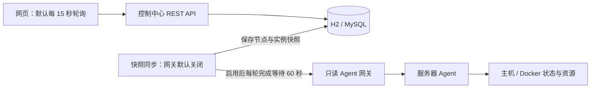

# 未序 Argus 项目说明与进度汇报

更新：2026-10-08，北京时间（UTC+08:00）。本报告汇总当前源码、验证记录和下一阶段工作，不包含真实环境连接信息。

**当前已经完成基础只读 MVP：网页、Java 控制中心、数据库和服务器 Agent 有了可运行的基础。完整的非 AI 运维闭环尚未完成，企业级组件和 AI 功能也没有交付。** 不用完成百分比衡量进度，以实际链路和验收结果为准。

## 一、项目做什么，在哪里继续开发

Argus 面向个人和小团队，把分散在多台服务器上的服务状态集中到一个网页，逐步提供资源观察、日志查询、受控操作和故障追踪。Minecraft 是首个业务场景；目标还包括普通 Docker 服务、Java 应用、Open WebUI 等，但这些业务的专属适配器并没有全部实现。目前可复用的是主机与 Docker 的基础采集能力。

现有两个工程承担不同职责：

| 目录 | 作用与状态 |
|---|---|
| `Argus/` | Java 21、Spring Boot 3.5.16 的学习沙盒；第 05 课 Service 待完成，用于学习传统 Java 开发 |
| `weixu01/` | Java 17 的产品实践主仓库，包含后端、前端、服务器 Agent、部署模板和文档；接下来的 Agent 开发在这里推进 |
| `weixu01/relay/` | 独立聊天中转站，已交给另一会话维护；不计入业务 Agent 或 AI 功能成果 |

本报告是统一阅读入口。源码与 Git 使用相同配置模板，数据库连接等真实值由 IDEA 个人运行配置或仓库外环境变量注入。

## 二、Agent 是什么，记忆存在哪里

- **Node（节点）**：一台被管理的服务器。
- **Instance（实例）**：节点上的一个服务，例如一个容器或 Minecraft 服务。
- **服务器 Agent**：运行在被管主机上的 Java 程序，采集本机状态，通过受控接口读取 Docker；它不依赖大模型。
- **未来 AI Agent**：理解用户问题、查询证据、检索知识并提出运维方案；执行仍须经过业务权限和任务系统，目前尚未实现。

持久化要分开看：控制中心的节点、实例、任务、日志已写入 H2/MySQL，Flyway 管理表结构；服务器 Agent 的任务记录仍在内存中，进程重启会丢失。AI 会话、长期记忆、向量检索及 RAG 知识库都未实现。已有技术资料是官方来源索引和归纳，不等于可检索的知识库。

## 三、技术栈与现有业务流程

| 层次 | 已使用或已有模板 | 作用 |
|---|---|---|
| 控制中心 | Java 17、Spring Boot 3.3.5 | 提供接口、业务服务、定时同步和访问保护 |
| 数据层 | JdbcTemplate、Flyway 10.20.1、H2/MySQL | 持久化、事务和 V1–V3 结构迁移 |
| 管理台 | Vue 3.5.43、TypeScript 5.7.3、Vite 6.4.3 | 五个管理页面；版本以 lockfile 为准 |
| 服务器 Agent | JDK HttpServer、Docker CLI | HTTP 接口、主机及容器采集、受控执行器 |
| 部署 | Nginx、systemd 和备份模板 | 静态站点、反向代理、服务管理和备份流程 |

传统 Java 分层已经体现：Controller 接收请求和参数，Service 处理业务规则与事务，Repository 用 JdbcTemplate 访问数据库；另有 DTO、领域对象、统一响应和异常处理。它是模块化单体的基础，并非已经完成的微服务体系。

当前是控制中心拉取，Agent 没有主动注册、定时心跳上报闭环。网页日志查询中央 `logs` 表；Agent 日志读取和只读网关另有接口，还没有接到网页日志链路。网页提交任务后，后端只改变数据库中的实例与任务状态；显示成功不代表 Docker 已执行。

## 四、现有功能与交付边界

| 模块 | 当前已有 | 限制与验收边界 |
|---|---|---|
| 网页 | 概览、节点、实例、任务、日志；令牌输入与只读提示 | 添加节点、创建实例、日志导出仍是占位；任务筛选未接通 |
| 数据展示 | API 读取、状态与资源快照、定时刷新 | 开发模式可回退演示数据；生产失败会清空数据并显示不可用 |
| 数据库 | H2 默认配置、MySQL profile、迁移与持久化 | 有配置不等于今日已连通远程 MySQL；暂无租户模型 |
| Agent 采集 | 主机 CPU/内存、容器发现、状态、资源、日志查询 | 缺少明确的采集失败与过期语义；玩家数/TPS 未真实采集 |
| Agent 执行 | mock/Docker 执行器、动作白名单、超时及任务队列上限 | 远程动作默认关闭；任务不持久化，中央下发与结果回传未接通 |
| 访问与指标 | 基础 Bearer 令牌、只读拦截、目标白名单、受保护的 `/metrics` | 不是完整登录、RBAC、审计，也没有历史指标与告警平台 |
| 品牌 | 银白横版“未序” Logo、未序娘头像 | 仅界面形象，没有 AI 对话、诊断或自主执行能力 |
| 运维材料 | 发布、备份、回滚模板与说明 | 不能代替实际部署核验、恢复演练和容量测试 |

界面仍有容易误解的文字：“实时日志 / LIVE”实际是数据库查询，“最后心跳”实际来自轮询快照；缺失玩家数默认显示 0、TPS 在数据归一化中默认 20。这些值不能当作正常实测指标，应在下一阶段一起修正。

## 五、验证到了哪一步

**本次验证：2026-10-08 21:24，北京时间。** 后端执行 Maven 离线测试，共 8 项通过，失败、错误、跳过均为 0。范围为 H2 的 V1–V3 迁移、后端接口及本机网关 mock；未连接真实 MySQL、Docker 或远程服务器。

前端类型检查与构建、Agent Java 编译的最近已有记录是 2026-10-07。前端当时复用已安装依赖，未重新执行 `npm ci`；本轮对前端和 Agent 仅作静态审查。Agent 目前没有独立自动化测试套件，编译通过不能证明异常和恢复行为正确。

因此要分清三层证据：源码说明“具备什么”；历史部署记录说明“当时部署过什么”；今日在线状态需要另行探查。本轮没有探查服务器，不据旧记录宣称当前网站、数据库或 Agent 在线，也不把聊天中转站可用当作 Argus 可用。

## 六、接下来先做服务器 Agent，AI 后置

第一步修复多节点实例身份，以 `nodeId + agentInstanceId` 区分不同主机的同名容器；补齐采集来源、采样时间、可用性和过期状态。同步明确协议和最小 Adapter 接口，先支持主机与 Docker，业务专属指标按类型另行适配，不靠猜测判断采集能力。

第二步加入持久化、幂等的任务状态机，以及执行前的权限和审计，再打通真实动作与结果回传。不能先开放生产按钮、后补权限和恢复机制。现有 Agent 还需处理两项基础风险：Docker 输出先等待进程结束再读取，大量日志可能堵塞管道；HTTP 工作线程数有限，但底层等待队列尚未有界，不能据此宣称已具备高并发保护。

下一阶段按以下条件验收：

1. 两个节点的同名容器可以独立采集、查询和定位，旧数据迁移后不互相覆盖。
2. 未采集、失败、离线和过期状态可区分，网页不再用默认正常值代替缺失指标。
3. 协议和 Adapter 有明确能力说明；大日志、超时、请求突发有可验证的限制与错误结果。
4. 隔离测试中，重复任务不产生重复副作用；Agent 重启后能恢复记录并核对未完成任务。
5. 真实动作开放前，越权请求被拒绝、操作有审计；页面、中央任务和容器最终状态一致。

企业化路线保留如下，均为计划，阶段编号不意味着已完成。P0 已有设计基线，但尚未正式冻结，也未完成契约和退出条件验证；安全工作必须提前覆盖真实执行。

| 阶段 | 计划内容 |
|---|---|
| P0 | 冻结协议、领域模型、任务状态机和权限边界 |
| P1 | 完善实例身份、用户/项目/角色、任务事件与审计数据 |
| P2 | Redis 临时状态与限流、RabbitMQ、Outbox/Inbox 和可靠任务 |
| P3 | WebSocket、Prometheus 存储、Grafana、Loki 与告警 |
| P4 | 完整 RBAC、凭据轮换及细粒度授权；执行前先落实必要部分 |
| P5 | 多副本、压力与故障测试、备份恢复演练 |
| P6 | AI 只读诊断、RAG、证据追踪，再复用受控任务执行 |

## 七、自查入口

- 项目总览：[README](../README.md)；持续记录：[开发进度](开发进度.md)、[问题记录](问题记录.md)、[验收清单](验收清单.md)。
- 当前 Agent：[使用说明](../agent/README.md)、[采集实现](../agent/src/main/java/com/argus/agent/service/InstanceService.java)、[任务实现](../agent/src/main/java/com/argus/agent/service/TaskService.java)。
- 中央链路：[快照同步](../backend/src/main/java/com/argus/controlcenter/service/AgentSnapshotSyncService.java)、[任务服务](../backend/src/main/java/com/argus/controlcenter/service/TaskService.java)；网页边界：[API 处理](../frontend/src/api.ts)。
- 目标架构：[平台设计](Argus平台设计文档.md)、[企业级架构](Argus企业级架构重设计.md)、[迁移计划](Argus从MVP到生产迁移计划.md)。旧设计中的版本和“缺少认证/指标”等概述以当前源码及本报告的具体边界为准。

本轮先交付说明与进度，不提前改动业务代码。继续开发的起点是多节点实例身份和可信采集，Agent 真实命令执行继续保持关闭。
