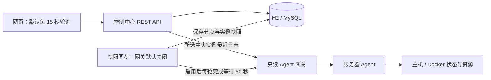

# 未序 Argus 项目说明与进度汇报

更新：2026-10-08，北京时间（UTC+08:00）。本报告汇总当前源码、验证记录和下一阶段工作，不包含真实环境连接信息。

**当前基础只读 MVP 已具备，本轮又完成了多节点实例身份、可信采集展示、网页 Agent 最近日志和 Agent 资源边界修复。模块及本机跨模块验证已通过，尚未部署。完整的非 AI 远程执行、权限审计和任务恢复闭环仍未完成，AI 也未接入。** 不报完成百分比，以功能链路和验收证据为准。

本次最直接的变化是：两台机器上的同名容器可以分开查询；缺失指标不会再冒充正常值；网页能定位所选实例的 Agent 读取最近日志，并区分失败和空日志。真实控制仍保持关闭。

## 一、项目做什么，在哪里继续开发

Argus 面向个人和小团队，把分散在多台服务器上的服务状态集中到一个网页，逐步提供资源观察、日志查询、受控操作和故障追踪。Minecraft 是首个业务场景；目标还包括普通 Docker 服务、Java 应用、Open WebUI 等，但这些业务的专属适配器并没有全部实现。目前可复用的是主机与 Docker 的基础采集能力。

现有两个工程承担不同职责：

| 目录 | 作用与状态 |
|---|---|
| `Argus/` | Java 21、Spring Boot 3.5.16 的学习沙盒；第 05 课 Service 待完成，用于学习传统 Java 开发 |
| `weixu01/` | Java 17 的产品实践主仓库，包含后端、前端、服务器 Agent、部署模板和文档；接下来的 Agent 开发在这里推进 |
| `weixu01/relay/` | 独立聊天中转站，已交给另一会话维护；不计入业务 Agent 或 AI 功能成果 |

本报告是统一阅读入口。源码与 Git 使用相同配置模板，数据库连接等真实值由 IDEA 个人运行配置或仓库外环境变量注入。

## 二、Agent 是什么，记忆存在哪里

- **Node（节点）**：一台被管理的服务器。
- **Instance（实例）**：节点上的一个服务，例如一个容器或 Minecraft 服务。
- **服务器 Agent**：运行在被管主机上的 Java 程序，采集本机状态，通过受控接口读取 Docker；它不依赖大模型。
- **未来 AI Agent**：理解用户问题、查询证据、检索知识并提出运维方案；执行仍须经过业务权限和任务系统，目前尚未实现。

持久化要分开看：控制中心的节点、实例、任务、日志已写入 H2/MySQL，Flyway 管理表结构；服务器 Agent 的任务记录仍在内存中，进程重启会丢失。AI 会话、长期记忆、向量检索及 RAG 知识库都未实现。已有技术资料是官方来源索引和归纳，不等于可检索的知识库。

## 三、技术栈与现有业务流程

| 层次 | 已使用或已有模板 | 作用 |
|---|---|---|
| 控制中心 | Java 17、Spring Boot 3.3.5 | 提供接口、业务服务、定时同步和访问保护 |
| 数据层 | JdbcTemplate、Flyway 10.20.1、H2/MySQL | 持久化、事务和 V1–V4 结构迁移 |
| 管理台 | Vue 3.5.43、TypeScript 5.7.3、Vite 6.4.3 | 五个管理页面；版本以 lockfile 为准 |
| 服务器 Agent | JDK HttpServer、Docker CLI | HTTP 接口、主机及容器采集、受控执行器 |
| 部署 | Nginx、systemd 和备份模板 | 静态站点、反向代理、服务管理和备份流程 |

传统 Java 分层已经体现：Controller 接收请求和参数，Service 处理业务规则与事务，Repository 用 JdbcTemplate 访问数据库；另有 DTO、领域对象、统一响应和异常处理。它是模块化单体的基础，并非已经完成的微服务体系。

当前是中央拉取，Agent 没有主动注册或定时心跳上报。快照先整份校验、再事务保存；网页按来源和采集时间显示。最近日志通过新中央实例接口定位正确节点，按需/轮询读取，不是持续日志流；旧 `/api/logs` 保留为数据库摘要接口。任务接口仍只改变中央模拟状态，成功不代表 Docker 已执行。

## 四、现有功能与交付边界

| 模块 | 本轮已实现 | 限制与验收边界 |
|---|---|---|
| 网页 | 五页、令牌输入、只读提示、来源/时间/旧快照展示 | 添加节点和创建实例仍未开放，任务为模拟记录 |
| 实例身份 | 中央 ID 与节点内 ID 分离，不同节点同名容器独立 | 迁移无法恢复历史上已被覆盖丢失的归属 |
| 数据库 | V4 保留旧中央 ID/FK、复合唯一键、可空指标和微秒时间 | MySQL DDL 不能假定失败整批回滚；生产未迁移 |
| 可信采集 | 真实 0、null、MOCK/LEGACY 分开，记录尝试/成功/采样时间 | 玩家数/TPS 未采集，最小业务 Adapter 注册仍待做 |
| 最近日志 | 网页按中央 ID 读取正确节点，校验身份、防晚到请求串线 | 不是历史全文检索或 WebSocket 持续流 |
| Agent 资源边界 | 持续读取命令输出，超时/超限清理；HTTP 等待队列有界 | 背压不是 429 限流，也没有高并发容量结论 |
| 执行与访问 | mock/Docker 执行器、动作白名单、基础认证与只读保护 | 中央尚未下发任务；Agent 任务内存保存，完整 RBAC/审计未完成 |
| 指标与品牌 | 受保护的 `/metrics`、银白 Logo、未序娘头像 | 无历史指标/告警平台；角色仅展示，无 AI 功能 |

界面已去掉把数据库日志叫“实时 LIVE”、把未知玩家数补 0、把缺失 TPS 补 20 等误导。开发与生产都不自动回退成演示成功。快照超过 180 秒、节点离线或同步失败会明确标旧；完整新批次没有出现的实例立即标“本轮未发现”，历史值保留但不计入近期运行统计。

## 五、验证到了哪一步

2026-10-08 本轮已完成以下本地检查：

| 范围 | 结果 | 使用的环境 |
|---|---|---|
| Agent | 23 项 Java 行为检查和独立 JSON 解析通过 | Java 17、本机 HTTP、模拟 Docker、测试子进程，含父孙进程清理 |
| 后端 | 29 项均实际执行通过，分两次运行 | H2/mock 首轮通过 28、跳过 MySQL 1；隔离 MySQL 8.0.27 专项随后 1/1 通过 |
| 前端 | 17 项测试、类型检查/构建通过，Edge 14 类检查通过 | 本机隔离接口，桌面/手机布局及同名切换、错误等交互 |
| 跨模块 | 最终修复版 22 项断言再次全部通过 | 两个实际 Java 17 Agent 进程（mock 模式）、打包后端和本机隔离 MySQL；身份/日志、时间、认证只读、断连及重启 |

MySQL 专项从含旧数据的 V3 升至最终 V4，验证旧 ID/FK、大小写隔离、并发首次发现、null 与微秒精度；并发删除节点后采集不会将其复活。前端仍用现有依赖，没有升级或重新安装。普通后端测试不配置专用本机测试库时会跳过 MySQL 专项，不能据 H2 通过报告完整 MySQL 验收。

源码能力、模块测试、跨模块测试、历史部署、今日在线状态分开记录。本轮未连接真实 Docker、远程服务器或修改生产环境，没有业务恢复或负载结论；聊天中转站可用也不能证明 Argus 线上可用。

## 六、下一阶段：可靠任务与权限，AI 后置

本轮解决了多节点身份和可信采集的基础，接下来先设计持久化幂等任务、权限审计和状态对账，再打通真实操作与结果回传。Agent 的命令读取和队列问题已有修复，但尚未因此具备重启恢复或企业级高可用。

业务扩展需要最小 Adapter 接口及能力协商，先复用主机/Docker 采集，再按类型增加专项指标，不根据容器名称猜测全部业务能力。真实动作开放前至少满足：

1. 重复投递不会重复产生副作用，任务尝试、结果和审计可持久化追踪。
2. Agent 与中央重启或断网后能恢复未完成任务，并核对实际容器状态。
3. 越权、过期凭据和错误节点/实例请求被拒绝，权限在服务端执行。
4. 隔离真实 Docker 环境中，页面任务与最终容器状态一致，失败/超时可解释。
5. 新 Adapter 的能力、单位、来源与缺失状态有协议及测试，再接入历史监控和告警。

企业化路线保留如下，均为计划，阶段编号不意味着已完成。P0 已有设计基线，但尚未正式冻结，也未完成契约和退出条件验证；安全工作必须提前覆盖真实执行。

| 阶段 | 计划内容 |
|---|---|
| P0 | 冻结协议、领域模型、任务状态机和权限边界 |
| P1 | 完善实例身份、用户/项目/角色、任务事件与审计数据 |
| P2 | Redis 临时状态与限流、RabbitMQ、Outbox/Inbox 和可靠任务 |
| P3 | WebSocket、Prometheus 存储、Grafana、Loki 与告警 |
| P4 | 完整 RBAC、凭据轮换及细粒度授权；执行前先落实必要部分 |
| P5 | 多副本、压力与故障测试、备份恢复演练 |
| P6 | AI 只读诊断、RAG、证据追踪，再复用受控任务执行 |

## 七、自查入口

- 项目总览：[README](../README.md)；持续记录：[开发进度](开发进度.md)、[问题记录](问题记录.md)、[验收清单](验收清单.md)。
- 当前 Agent：[使用说明](../agent/README.md)、[采集实现](../agent/src/main/java/com/argus/agent/service/InstanceService.java)、[任务实现](../agent/src/main/java/com/argus/agent/service/TaskService.java)。
- 中央链路：[快照同步](../backend/src/main/java/com/argus/controlcenter/service/AgentSnapshotSyncService.java)、[任务服务](../backend/src/main/java/com/argus/controlcenter/service/TaskService.java)；网页边界：[API 处理](../frontend/src/api.ts)。
- 目标架构：[平台设计](Argus平台设计文档.md)、[企业级架构](Argus企业级架构重设计.md)、[迁移计划](Argus从MVP到生产迁移计划.md)。旧设计中的版本和“缺少认证/指标”等概述以当前源码及本报告的具体边界为准。

当前交付是源码与本地验证结果，发布另行进行。Agent 真实命令执行继续保持关闭；完整权限、可靠任务和恢复验证是下一阶段的前置工作。
