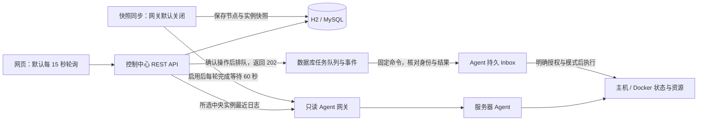

# 未序 Argus 项目说明与进度汇报

更新：2026-10-08，北京时间（UTC+08:00）。本报告汇总当前源码、验证记录和下一阶段工作，不包含真实环境连接信息。

**基础只读 MVP 已具备，本轮可靠任务实现也已落地：中央持久排队、Agent 持久接收与恢复、基础操作授权、网页确认及事件查询。Agent、后端和前端模块检查及本机实际跨模块 28 项断言均通过。本轮尚未部署，也未执行真实 Docker 操作；完整非 AI 运维与权限审计体系尚未完成，AI 未接入。** 不报完成百分比，以链路和验收证据为准。

现在网页提交只表示任务被接收，不再把中央数据库模拟完成当成容器执行成功。网络中断后保留原请求标识，Agent 重启遇到执行结果不明会停止重放。两台机器上的同名容器仍独立查询，缺失指标、旧快照和日志错误明确标记，真实控制继续默认关闭。

## 一、项目做什么，在哪里继续开发

Argus 面向个人和小团队，把分散在多台服务器上的服务状态集中到一个网页，逐步提供资源观察、日志查询、受控操作和故障追踪。Minecraft 是首个业务场景；目标还包括普通 Docker 服务、Java 应用、Open WebUI 等，但这些业务的专属适配器并没有全部实现。目前可复用的是主机与 Docker 的基础采集能力。

现有两个工程承担不同职责：

| 目录 | 作用与状态 |
|---|---|
| `Argus/` | Java 21、Spring Boot 3.5.16 的学习沙盒；第 05 课 Service 待完成，用于学习传统 Java 开发 |
| `weixu01/` | Java 17 的产品实践主仓库，包含后端、前端、服务器 Agent、部署模板和文档；接下来的 Agent 开发在这里推进 |
| `weixu01/relay/` | 独立聊天中转站，已交给另一会话维护；不计入业务 Agent 或 AI 功能成果 |

本报告是统一阅读入口。源码与 Git 使用相同配置模板，数据库连接等真实值由 IDEA 个人运行配置或仓库外环境变量注入。

## 二、Agent 是什么，记忆存在哪里

- **Node（节点）**：一台被管理的服务器。
- **Instance（实例）**：节点上的一个服务，例如一个容器或 Minecraft 服务。
- **服务器 Agent**：运行在被管主机上的 Java 程序，采集本机状态，通过受控接口读取 Docker；它不依赖大模型。
- **未来 AI Agent**：理解用户问题、查询证据、检索知识并提出运维方案；执行仍须经过业务权限和任务系统，目前尚未实现。

持久化要分开看：中央的节点、实例、任务、队列、互斥与事件写入 H2/MySQL；Agent 在独占目录以原子文件保存 Inbox，正常重启保留命令和结果。PENDING 可恢复，RUNNING 崩溃转 UNKNOWN 并保留互斥；模拟容器状态仍在进程内，不等同于真实 Docker 状态。AI 会话、长期记忆、向量检索及 RAG 均未实现，技术资料索引也不等于知识库。

## 三、技术栈与现有业务流程

| 层次 | 已使用或已有模板 | 作用 |
|---|---|---|
| 控制中心 | Java 17、Spring Boot 3.3.5 | 提供接口、业务服务、定时同步和访问保护 |
| 数据层 | JdbcTemplate、Flyway 10.20.1、H2/MySQL | 持久化、事务和 V1–V5 结构迁移 |
| 管理台 | Vue 3.5.43、TypeScript 5.7.3、Vite 6.4.3 | 五个管理页面；版本以 lockfile 为准 |
| 服务器 Agent | JDK HttpServer、Docker CLI | HTTP 接口、主机及容器采集、受控执行器 |
| 部署 | Nginx、systemd 和备份模板 | 静态站点、反向代理、服务管理和备份流程 |

传统 Java 分层已经体现：Controller 接收请求和参数，Service 处理业务规则与事务，Repository 用 JdbcTemplate 访问数据库；另有 DTO、领域对象、统一响应和异常处理。它是模块化单体的基础，并非已经完成的微服务体系。

采集仍是中央拉取，没有主动心跳。快照先整份校验再保存；最近日志经中央实例定位节点，按需/轮询读取，旧 `/api/logs` 是数据库摘要。操作先验证令牌、允许目标和模式，再事务保存任务与事件；worker 按固定 commandId 查询或投递，Agent 持久接收、执行前记录状态、执行后核验生命周期。202 不是执行成功，任务结果也不直接改写实例观测。

## 四、现有功能与交付边界

| 模块 | 本轮已实现 | 限制与验收边界 |
|---|---|---|
| 网页 | 五页、令牌输入、可信快照、风险确认、原键核对、任务事件 | 添加节点/创建实例未开放；模拟和历史任务不能当成真实执行 |
| 实例身份 | 中央 ID 与节点内 ID 分离，不同节点同名容器独立 | 迁移无法恢复历史上已被覆盖丢失的归属 |
| 数据库 | V4 保留旧 ID/FK；V5 新增可靠任务队列、互斥和事件 | 旧任务标为 LEGACY_MOCK，不自动下发；生产未迁移 |
| 可信采集 | 真实 0、null、MOCK/LEGACY 分开，记录尝试/成功/采样时间 | 玩家数/TPS 未采集，最小业务 Adapter 注册仍待做 |
| 最近日志 | 网页按中央 ID 读取正确节点，校验身份、防晚到请求串线 | 不是历史全文检索或 WebSocket 持续流 |
| Agent 资源边界 | 持续读取命令输出，超时/超限清理；HTTP 等待队列有界 | 背压不是 429 限流，也没有高并发容量结论 |
| 任务与恢复 | 数据库租约、幂等键、固定命令、Agent 原子 Inbox、结果核对 | 本机实际联调 28 项断言通过；不承诺副作用 exactly-once 或断电一致性 |
| 执行与访问 | 独立查看/操作令牌、双层目标授权、默认关闭、模式绑定 | 真实 Docker 未验收；完整 RBAC/审计、UNKNOWN 人工处理未完成 |
| 指标与品牌 | 受保护的 `/metrics`、银白 Logo、未序娘头像 | 无历史指标/告警平台；角色仅展示，无 AI 功能 |

界面已去掉把数据库日志叫“实时 LIVE”、把未知玩家数补 0、把缺失 TPS 补 20 等误导。开发与生产都不自动回退成演示成功。快照超过 180 秒、节点离线或同步失败会明确标旧；完整新批次没有出现的实例立即标“本轮未发现”，历史值保留但不计入近期运行统计。

## 五、验证到了哪一步

2026-10-08 本轮已完成以下本地检查：

| 范围 | 结果 | 使用的环境 |
|---|---|---|
| Agent | 44 项 Java 检查及独立 JSON 解析通过 | 原 23 + Inbox 21；真实进程崩溃三个窗口、跨进程锁、落盘失败及截止边界；Docker 为模拟 |
| 后端 | 54 个唯一用例分批实际通过 | H2 与显式启用的 MySQL 专项；有跳过的普通运行不能单独称全通过，重复运行不重复计数 |
| 前端 | 32 项测试、类型检查/构建及 Edge 13 类任务交互通过 | 本机隔离接口；确认、原键恢复、202、未知状态、注销与手机/桌面布局 |
| 跨模块 | 本轮可靠任务 28 项断言通过 | 生产构建前端与 Edge、实际后端 JAR、隔离 MySQL 8.0.27、双 Java mock Agent 及进程恢复 |

上一轮只读基线已通过后端 29 项（H2/mock 28，隔离 MySQL 专项 1）、前端 17 项/Edge 14 类和跨模块 22 项，验证 V4 身份、采集、日志与并发删除；这不是本轮 V5 任务验收。普通后端测试未配置专用 MySQL 测试库时会跳过专项，不能据 H2 通过报告完整 MySQL 验收。前端复用已有依赖。

本轮实际链路验证了网页确认/202/事件、同名实例隔离、同键并发唯一投递、角色和只读保护；丢失回应并重启中央/Agent 后查询原结果而不重投；更换 Inbox 身份后进入 UNKNOWN 并保持互斥。临时测试进程已关闭。

源码能力、模块测试、跨模块测试、历史部署、今日在线状态分开记录。本轮未连接真实 Docker、远程服务器或修改生产环境，没有业务恢复或负载结论；聊天中转站可用也不能证明 Argus 线上可用。

## 六、下一阶段：完成验证与人工核对，AI 后置

接下来补 UNKNOWN 人工核对、审计留痕和显式解除互斥，再做独立真实 Docker 验收。不能直接删 Inbox 或改数据库状态解除不确定性；回滚旧 Inbox 备份可能丢掉后续命令，必须停用控制、重新核对身份和任务。已有本地恢复验证不等于企业级高可用。

业务扩展需要最小 Adapter 接口及能力协商，先复用主机/Docker 采集，再按类型增加专项指标，不根据容器名称猜测全部业务能力。真实动作开放前至少满足：

1. 保留本轮幂等、双节点与进程恢复基线，在隔离真实 Docker 环境复核状态和故障边界。
2. UNKNOWN 的人工核对、操作留痕与解除规则有明确接口和回归验证。
3. 越权、过期凭据和错误节点/实例请求被拒绝，权限在服务端执行。
4. 隔离真实 Docker 环境中，页面任务与最终容器状态一致，失败/超时可解释。
5. 新 Adapter 的能力、单位、来源与缺失状态有协议及测试，再接入历史监控和告警。

企业化路线保留如下，阶段编号不意味着整体已完成。本轮任务接口已冻结；完整 P0 仅有设计基线，仍待全部契约与退出条件验证。安全工作必须先于真实执行。

| 阶段 | 计划内容 |
|---|---|
| P0 | 冻结协议、领域模型、任务状态机和权限边界 |
| P1 | 完善实例身份、用户/项目/角色、任务事件与审计数据 |
| P2 | 当前已有数据库投递队列/Agent Inbox；后续 Redis 限流、RabbitMQ 与容量验证 |
| P3 | WebSocket、Prometheus 存储、Grafana、Loki 与告警 |
| P4 | 完整 RBAC、凭据轮换及细粒度授权；执行前先落实必要部分 |
| P5 | 多副本、压力与故障测试、备份恢复演练 |
| P6 | AI 只读诊断、RAG、证据追踪，再复用受控任务执行 |

## 七、自查入口

- 项目总览：[README](../README.md)；持续记录：[开发进度](开发进度.md)、[问题记录](问题记录.md)、[验收清单](验收清单.md)。
- 当前 Agent：[使用说明](../agent/README.md)、[采集实现](../agent/src/main/java/com/argus/agent/service/InstanceService.java)、[任务实现](../agent/src/main/java/com/argus/agent/service/TaskService.java)。
- 任务边界：[冻结接口与恢复约定](可靠任务接口与恢复约定.md)、[持久 Inbox](../agent/docs/持久任务Inbox.md)。
- 中央链路：[快照同步](../backend/src/main/java/com/argus/controlcenter/service/AgentSnapshotSyncService.java)、[任务服务](../backend/src/main/java/com/argus/controlcenter/service/TaskService.java)；网页边界：[API 处理](../frontend/src/api.ts)。
- 目标架构：[平台设计](Argus平台设计文档.md)、[企业级架构](Argus企业级架构重设计.md)、[迁移计划](Argus从MVP到生产迁移计划.md)。旧设计中的版本和“缺少认证/指标”等概述以当前源码及本报告的具体边界为准。

当前交付是源码与已有本地验证结果，剩余验收与发布分别记录。真实控制继续关闭；完整权限、人工核对和真实 Docker 隔离验证仍是后续工作。
